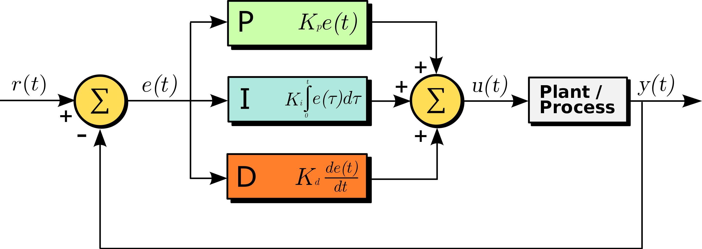

# Project: PID Controller


## Project Goal
In this project, I implemented a PID (proportional–integral–derivative) controller in C++ to maneuver the vehicle around the lake race track from the Behavioral Cloning Project. A typical PID controller contains three terms:
* Term P is proportional to the current value of the SP − PV error e(t).
* Term I accounts for past values of the SP − PV error and integrates them over time to produce the I term
* Term D is a best estimate of the future trend of the SP − PV error, based on its current rate of change

<p>
    
    <br>
    <em>Block Diagram of a PID Controller.</em>
</p>

[Source: https://en.wikipedia.org/wiki/PID_controller#/media/File:PID_en.svg](https://en.wikipedia.org/wiki/PID_controller#/media/File:PID_en.svg)

## Project files
### The codes
Among the original files from the project repository, I updated the following files to implement my PID controller for controller the vehicle to drive along the lacke track with dynamic PID parameters tuning on steering angle and pretuned parameters on throttle:

* [src/PID.cpp](src/PID.cpp)       PID routings with embedded Twiddle parameters tunning.
* [src/PID.h](src/PID.h)           Header file of my PID controller.
* [src/main.cpp](src/main.cpp)     Main program that contains the PID controller flow.


### The results
Screen recordings of the simulator to show the final results.
* [The results](https://youtu.be/f-bznjzn00c)            Running the car simulator with the my PID controller.

## Tunning PID parameters
Before running the parameters, I did a experiment to under the effects of P, I, and D parameters.
I tried setting only one of the three parameters to 1 each time and see the behavior change of the vehicle.
### The effects of PID parameters
* Term P 
   * $[1, 0, 0]$ Setting the P parameter to a positive value caused the vehicle to go back and forth between two lane lines like a sine wave.
   


   * $[-1, 0, 0]$ Setting the P parameter to a negative value caused the vehicle to directly drive up to the curb on the right.
   


* Term I 
   * $[0, 1, 0]$ Setting the I parameter to a postive value caused the vehicle to drive up to the curb on the left.
   

   
   * $[0, -1, 0]$ Setting the I parameter to a negative value caused the vehicle to drive up to the curb on the right.
   


* Term D
    * $[0, 0, 1]$ Setting the D parameter to a postive value made the vehicle wabble quickly and unstable.
    


   * $[0, 0, -1]$ Setting the D parameter to a negative value caused the vehicle to drive up to the curb on the left.


### Picking the initial PID parameters
In this project, I created two PID controllers.  One of which is controling steering wheel while the other one is responsible for throttle.  
* Steering wheel controller
The steering wheel controller use PID parameter $[0.109901, 0.0388477, 0.591048]$ which was previous generated by Twiddle as a starting point.  The would reduce the change of the vehicle driving out of road when the Twiddle is manipulating PID parameter.  In this case, $[0, 0, 0]$ is not a good starting point since the output will be zero for a while before Twiddle actually pick a non-zero value for P parameter.  In that time, vehicle will drive out of the road.  

* Throttle controller
In this project I enable another PID controller for throttle which use pretuned PID parameters $[0.11, 0.0, 0.0]$ and disable Twiddle for it for better acceleration at the beginning.  Enabling Twiddle for throttle controller in this case caused the vehicle to drive slower but smoother.  However, it sometime hit a bug of the simulator in which the simulator stopped responding to any json messages sent to it.  The car simply stalled on the road without hitting any obstacle.  A demo clip with Twiddle turned on for throttle controller is [here](https://youtu.be/cqs7WJ2B4Ig).
Not like steering controller which uses Cross Track Error, CTE (in this case, s_cte), received from the simulator directly.  The throttle controller combined CTE in an equation to create its CTE (v_cte).  When `v_cte` is a negative value, it will be divided by 100.0 to make the amplitude way more smaller than a positive value will be.  This can prevent `v_cte` from being a large negative value that might cause the vehicle to back up.  

```cpp
double delta_speed = speed - pid.target_speed;
double v_cte = ((delta_speed/pid.target_speed)/exp(fabs(s_cte)) + fabs(s_cte)*0.1)*20.0;
if (v_cte > 0.0) { v_cte /= 100.0; }
```    

### Enabling Twiddle 
Since both steering and throttle controller's values are between $-1$ and $1$ which are small value, setting `dp` to $[1, 1, 1]$ is not practical due to big value changes. In this project, I set $dp = [0.099, 0.0099, 0.00099]$ to make sure it doesn't cause big changes in the output values hece driving the vehicle up to the curbs.  Furthermore, it also ensure the additions or subtractions to the parameters will not make it zeros which will totally disable the PID controller.    
 
```python
    p = [Kp, Ki, Kd]
    dp = [0.099, 0.0099, 0.00099]
    initRun()
    run(p, best_err)
    // Temporarily exit to move vehicle with the value: -p[0]*e[0]-p[1]*e[0]-p[2]*e[2] 

    while sum(dp) > tol:
        for i in range(len(p)):
            p[i] += dp[i]
            initRun()
            run(p, err)
            // Temporarily exit to move vehicle with the value: -p[0]*e[0]-p[1]*e[0]-p[2]*e[2] 

            if err < best_err:
                best_err = err
                dp[i] *= 1.01
            else:
                p[i] -= 2 * dp[i]
                initRun()
                run(p, err)
                // Temporarily exit to move vehicle with the value: -p[0]*e[0]-p[1]*e[0]-p[2]*e[2] 

                if err < best_err:
                    best_err = err
                    dp[i] *= 1.01
                else:
                    p[i] += dp[i]
                    dp[i] *= 0.99

     ...
```

In this project, the data received from simulator was not enough to simulate the movemont with a virtual robot.  So I used the vehicle as the robot by asking the vehicle to try the moves proposed by Twiddle as shown in the pseudo code above.

 

## Final Result
The vehicle equiped with steering and throttle PID controllers.  It could drive up to 25 MPH without touching undrivable ground and lasted for more than two laps, which comply with the [project rubric](https://review.udacity.com/#!/rubrics/1972/view).   

[Final Result](https://youtu.be/f-bznjzn00c)

